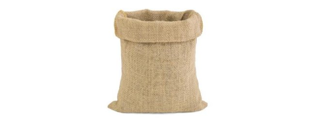

<p align="center"></p>

<h1 align="center">Gooni UI Tools</h1>

Gooni is a set of React components and utility functions, which are developed and maintained by Sahab front-end chapter members.

**📖 Component Library**: With the help of Storybook, all UI components are documented, and you can view the different states of each component and interact with them.

```bash
yarn storybook
```

## Contributing

We welcome contributions to Gooni! Development of Gooni happens in the open on GitHub, and we are grateful to the community for contributing bugfixes and improvements.

- 📥 Pull requests and 🌟 Stars are always welcome.

## Development Guide

After cloning the project, install dependencies in the root directory using yarn

```bash
yarn install
```

Manage dependencies and links

```bash
yarn lerna bootstrap
```

Build all packages

```bash
yarn prepublishOnly
```

💡 In order to watch changes to components on storybook while developing, `yarn start` in the the package to build as you develop.
